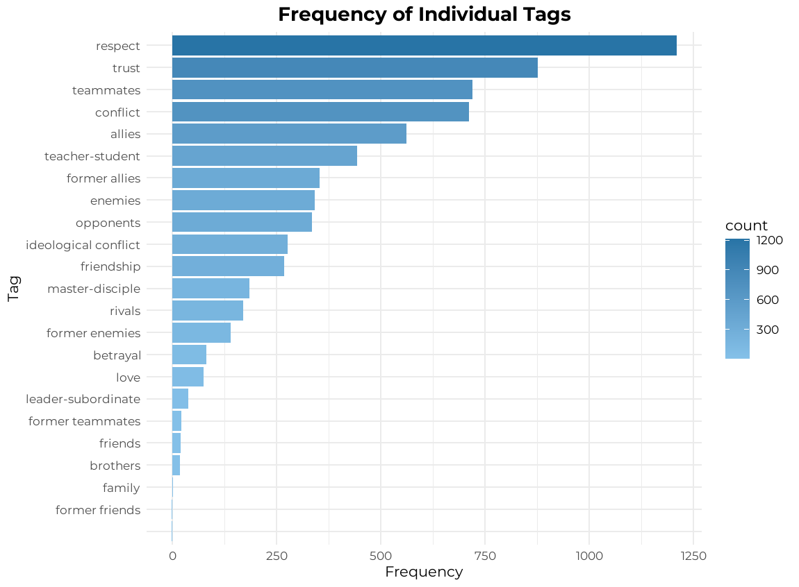

# Naruto Series Analysis

## 📌 Project Description
This project analyzes all episodes of the anime "Naruto" and "Naruto Shippuden" using data parsing, NLP analysis of character relationships, and data visualization. The final dataset provides insights into how character connections evolved throughout the series.

The project consists of several stages:
1. **Episode Parsing**: Collects episode numbers, titles, and links to description pages.
2. **Synopsis Parsing**: Extracts episode descriptions from Naruto Wiki.
3. **Character Relationship Analysis**: Uses Qwen API to analyze key interaction tags (e.g., "friendship," "betrayal," "conflict").
4. **Data Visualization**: Generates graphs of relationship changes using R.

## 📂 Project Structure
```
/src/               # Python scripts
/datasets/          # Parsed and processed datasets
/visualization/     # Graphs and visualizations
```

## 📄 Project Documentation
[📂 The presentation (PDF)](docs/presentation.pdf)

## 🚀 Installation
### 1️⃣ Clone the Repository
```sh
git clone https://github.com/adilbek-shaimardanov/naruto_project.git
cd naruto_project
```

### 2️⃣ Install Dependencies
```sh
pip install -r requirements.txt
```

### 3️⃣ Set Up API Key
Create a `.env` file in the project root and add the following line:
```sh
QWEN_API_KEY=your_api_key
```

## 🔥 Usage
### 1️⃣ Run Episode Parsing
```sh
python src/parsing_original.py
python src/parsing_shippuden.py
```

### 2️⃣ Run Synopsis Parsing
```sh
python src/synopsis.py
```

### 3️⃣ Analyze Data with Qwen API
```sh
python src/final_dataset.py
```

### 4️⃣ Visualize Data in RStudio
Open `graphs.R` in RStudio and run the script.

## 📊 Demo Results
Examples of Character interaction visualizations (there is more available!):




## 🤝 Contributing
You can contribute by submitting a `pull request` or creating an issue. Any help is welcome!

---
*P.S. Sorry, this README was generated with the help of ChatGPT because I was too lazy to write it myself.* 😅

### 📌 Author
Project created by **Adilbek Shaimardanov** 🍋
